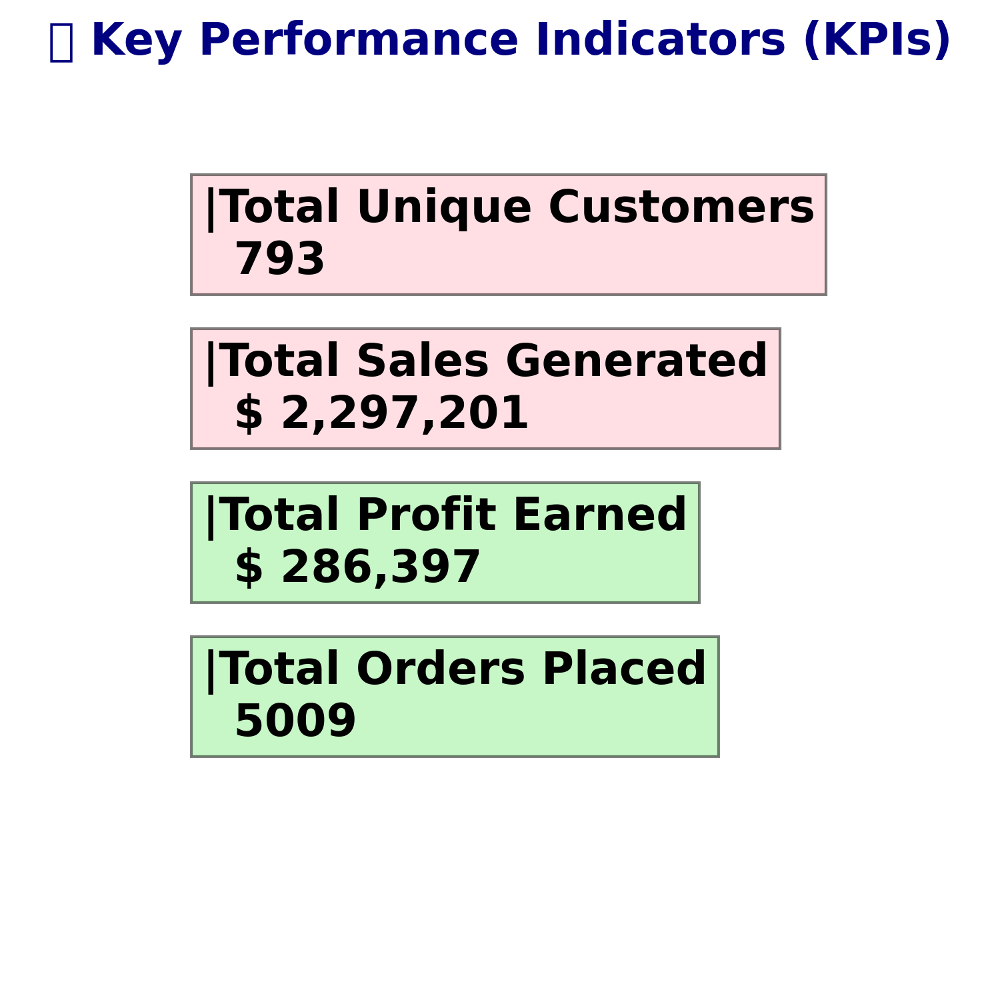
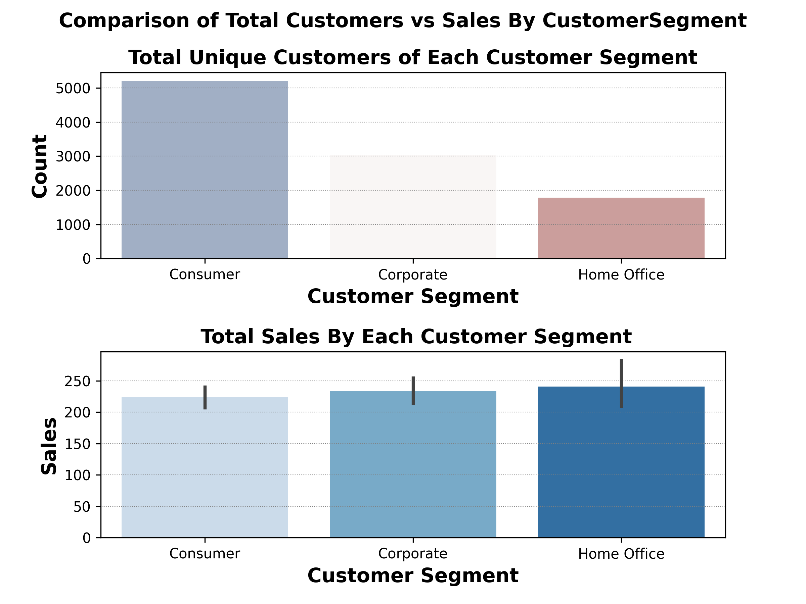
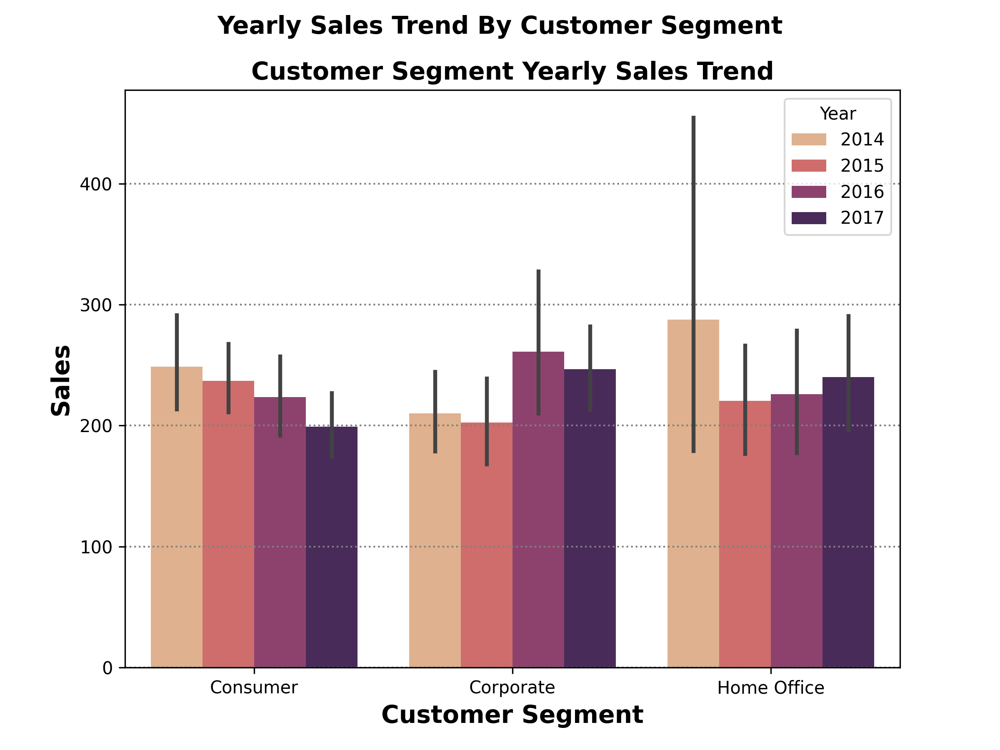
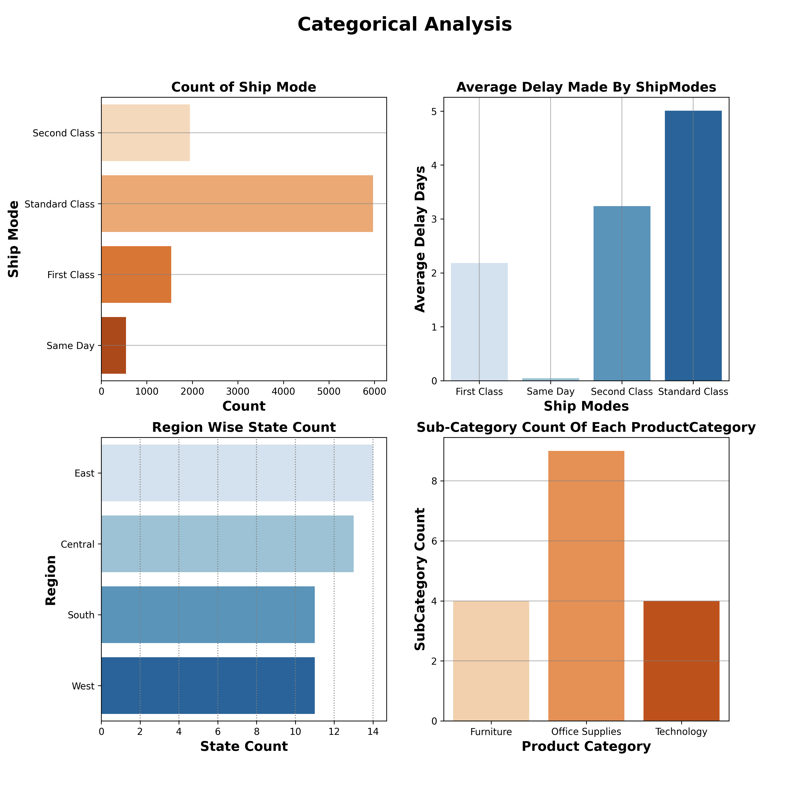

# Superstore-Business-Analytics
## Project Overview:
- This Python-based deep dive project analyzes an eCommerce superstore dataset to uncover valuable business insights. --- It includes advanced analyses such as customer segmentation, product basket analysis, and customer lifetime value (CLV). 
- The project also features key performance indicators (KPIs) visualization to track sales, profit, and customer metrics effectively.
- This comprehensive approach helps in making data-driven decisions to boost business performance.

### Importing Of All Required Liabraries
```python
import pandas as pd
import datetime as dt
import matplotlib.pyplot as plt
import seaborn as sns
import matplotlib.ticker as ticker
import numpy as np
pd.set_option('display.max_columns', None)
```
## Importing File
```python
Data=pd.read_csv('/storage/emulated/0/Download/archive(2) (4)/Sample - Superstore.csv',
encoding='latin1')
```
## #Checking Null
```python
NullChecking=Data.isnull().sum()
```

## Checking Duplicates

```python
Duplicates=Data.duplicated().sum()
```

## changing Datatypes
```python
Data['Order Date']=pd.to_datetime(Data['Order Date'])
Data['Ship Date']=pd.to_datetime(Data['Ship Date'])
```
##Renaming Columns
Data.rename(columns={'Segment':'Customer Segment',
'Category':'Product Category'},inplace=True)
## Adding Columns
```python
Data['Year']=Data['Order Date'].dt.year
Data['Day']=Data['Order Date'].dt.day_name()
Data['Delay Days']=(Data['Ship Date']-Data['Order Date']).dt.days
```
## 1.Key Insights:
```python
total_sales = Data['Sales'].sum()
total_profit = Data['Profit'].sum()
total_customers = Data['Customer ID'].nunique()
total_orders = Data['Order ID'].nunique()
```
```python
Visual Code
plt.text(0.1, 0.8, f"|Total Unique Customers\n  {total_customers}",
fontsize=16,family='arial',fontweight='bold', bbox=dict(facecolor='pink', alpha=0.5))
plt.text(0.1, 0.6, f"|Total Sales Generated\n  $ {total_sales:,.0f}",
fontsize=16,family='arial',fontweight='bold', bbox=dict(facecolor='pink', alpha=0.5))
plt.text(0.1, 0.4, f"|Total Profit Earned\n  $ {total_profit:,.0f}",
fontsize=16,family='arial',fontweight='bold', bbox=dict(facecolor='lightgreen', alpha=0.5))
plt.text(0.1, 0.2, f"|Total Orders Placed\n  {total_orders}",
fontsize=16,family='arial',fontweight='bold', bbox=dict(facecolor='lightgreen', alpha=0.5)
plt.axis('off')
# Hide axes
plt.tight_layout(rect=[0,0,0,1])
plt.savefig('Kpi.png')
plt.show()
```


## 2.Top10 Cities Revenue Generated vs Top10 profit Earned Cities 

### Steps:

1.Groups the dataset by City.

2.Calculates total Sales and Profit for each city.

3.Sorts the results by Sales in descending order.

4.Returns the top 10 cities based on revenue generated

5.Performs the same grouping and aggregation.

6.Sorts the cities based on Profit in descending order.

Returns the top 10 cities that earned the highest profit.
```python
Top10RevenueCities=Data.groupby('City')
[['Sales','Profit']].sum().sort_values(by='Sales',ascending=False)
.head(10)

Top10ProfitCities=Data.groupby('City')
[['Sales','Profit']].sum().sort_values(by='Profit',ascending=False)
.head(10)
```
```plaintext
Sales      Profit
City
New York City  256368.1610  62036.9837
Los Angeles    175851.3410  30440.7579
Seattle        119540.7420  29156.0967
San Francisco  112669.0920  17507.3854
Philadelphia   109077.0130 -13837.7674
Houston         64504.7604 -10153.5485
Chicago         48539.5410  -6654.5688
San Diego       47521.0290   6377.1960
Jacksonville    44713.1830  -2323.8350
Springfield     43054.3420   6200.6974
                    Sales      Profit
City
New York City  256368.161  62036.9837
Los Angeles    175851.341  30440.7579
Seattle        119540.742  29156.0967
San Francisco  112669.092  17507.3854
Detroit         42446.944  13181.7908
Lafayette       25036.200  10018.3876
Jackson         24963.858   7581.6828
Atlanta         17197.840   6993.6629
Minneapolis     16870.540   6824.5846
San Diego       47521.029   6377.1960
```
### ✨ Interpretation:
- 1.The first four cities — New York City, Los Angeles, Seattle, and San Francisco — appear in both Top Sales and Top Profit lists, indicating strong alignment between sales revenue and profitability.

- 2.This suggests these cities generate high sales efficiently, converting revenue into profit effectively.
- 3.Cities like Philadelphia, Chicago, Houston, and Jacksonville have high sales but show negative profits, possibly due to:

- i.Higher operational costs

- ii.Increased discounts or returns

- iii.Other expenses affecting profitability

- These areas require further investigation to understand why profits are negative despite good sales.

- 4.Conversely, cities such as Detroit, Lafayette, Jackson, Atlanta, and Minneapolis have moderate or low sales but are among the top profit earners.

- 5.This indicates efficient operations or higher profit margins in these locations, contributing positively to overall profitability.


## 3.1 💰 Customer Lifetime Value (CLV) Analysis

In this step, we calculate the CLV for each customer by combining their average purchase value, purchase frequency, and lifespan. Based on the average CLV, customers are segmented into High Value and Low Value categories.

### ✔️ Key Metrics:
 - 1.Average Purchase Value = Total Sales / Number of Unique Orders

 - 2.Purchase Frequency = Number of Unique Orders per Customer

- 3.Customer Lifespan = Duration between First and Last Purchase (in years)

 - 4.CLV = Average Purchase Value × Purchase Frequency × Lifespan

```python
# Calculate Average Purchase Value
1.Avg_Purchase_Value = Data.groupby('Customer ID')['Sales'].sum() / Data.groupby('Customer ID')['Order ID'].nunique()
Avg_Purchase_Value = Avg_Purchase_Value.reset_index(name='Avg_Purchase_Value')

# Calculate Customer Purchase Frequency
2.Customer_Purchase_Frequency = Data.groupby('Customer ID')['Order ID'].nunique().reset_index(name='Purchase Frequency')

# Calculate Customer Lifespan in Years
3.lifespan = Data.groupby('Customer ID').agg(
    First_Purchase=('Order Date', 'min'),
    Last_Purchase=('Order Date', 'max')
).reset_index()
4.lifespan['Lifespan_Years'] = np.floor((lifespan['Last_Purchase'] - lifespan['First_Purchase']).dt.days / 365)
5.lifespan['Lifespan_Years'] = lifespan['Lifespan_Years'].astype(int)

# Merge All DataFrames
5.CLV_Data = pd.merge(Avg_Purchase_Value, Customer_Purchase_Frequency, on='Customer ID')
6.CLV_Final_Data = pd.merge(CLV_Data, lifespan, on='Customer ID')

# Calculate CLV
7.CLV_Final_Data['Customers_Lifetime_Value'] = (
    CLV_Final_Data['Avg_Purchase_Value'] *
    CLV_Final_Data['Purchase Frequency'] *
    CLV_Final_Data['Lifespan_Years']
)

# Segment Customers Based on Average CLV
8.Avg_Clv = CLV_Final_Data['Customers_Lifetime_Value'].mean()
9.CLV_Final_Data['CLV_Segment'] = np.where(
    CLV_Final_Data['Customers_Lifetime_Value'] > Avg_Clv,
    'High Value',
    'Low Value'
)
```
```pandas

Customer ID  Avg_Purchase_Value  Purchase Frequency First_Purchase  \
0    AA-10315         1112.712000                   5     2014-03-31
1    AA-10375          117.376667                   9     2014-04-21
2    AA-10480          447.628000                   4     2014-05-04
3    AA-10645          847.822500                   6     2014-06-22
4    AB-10015          295.385333                   3     2014-02-18

  Last_Purchase  Lifespan_Years  Customers_Lifetime_Value CLV_Segment
0    2017-06-29               3                 16690.680  High Value
1    2017-12-11               3                  3169.170   Low Value
2    2017-04-15               2                  3581.024   Low Value
3    2017-11-05               3                 15260.805  High Value
4    2016-11-10               2                  1772.312   Low Value

```
## 3.2 📊 CLV Segment Distribution Analysis

This visualization helps to understand how the CLV values are distributed between High Value and Low Value customer segments.
```python
Visual Code

plt.figure(figsize=(6,5),dpi=300)

sns.boxplot(data=CLV_Final_Data,  x='Customers_Lifetime_Value',y='CLV_Segment', palette='flare')
plt.xlabel('Customers Value',fontsize=12, fontweight='heavy')
plt.ylabel('CLV Segment',fontsize=12, fontweight='heavy')
plt.yticks(rotation=90)


plt.suptitle('(CLV) Distribution Analysis',fontsize=16, fontweight='heavy')

plt.savefig('(CLV)1.png')
plt.tight_layout(rect=[0,0,0,1])
plt.subplots_adjust(hspace=0.5,wspace=0.5)
plt.show()
```
### 3.3 Finding Outliers
2.png)

## 3.4 Distribution of Data with High Value vs Low Value Customers
```python
Count the number of customers in each CLV segment
segment_counts = CLV_Final_Data['CLV_Segment'].value_counts()
````
1.png)


### ✨ Interpretation
 - As we Can See We have both Customers High Value and Low Value.
- High Value Customers Are More We have gained.
- There Are also Some of the Customers In High Value have More Value compared to Others giving Priorities to thdm is very much needed as they are helping us to create high revenue and profits.
- Customers having lifespan Between 1 to 4 years Showing Customer Loyalty Toward are business as they are Regular and Long time Customers.
- As we have total 4 Years Data We Given Lifespan Value Based on their existence in the business from First purchase  Date to Last Purchase Date to know their exact lifespan in the business.
- 
## 4.🧑‍🦱 Customer Segment Analysis
 - simply grouping the data based on Customer segment.
 - finding total number of unique customers from each segment.
 - To See From where we have most customers vs where we have generated more sales.
 - Then Sales Trend of Customer Segment by year to see which customer segment have grown or which segment performance declined.
```python
CustomersByCustomerSegment=Data.groupby('Customer Segment')['Customer ID'].nunique().reset_index()
CustomersByCustomerSegment.columns=['Customer Segment','Unique Customers']
```
```python
Visual Code
plt.figure(figsize=(8, 6),dpi=300)
plt.subplot(2,1,1)
sns.countplot(data=Data,x='Customer Segment',palette='vlag')
plt.title('Total Unique Customers of Each Customer Segment',fontsize=14,fontweight='heavy')
plt.xlabel('Customer Segment',fontsize=14,fontweight='heavy')
plt.ylabel('Count',fontsize=14,fontweight='heavy')
plt.grid(axis='y',color='gray',linestyle=':',linewidth=0.5)

plt.subplot(2,1,2)
sns.barplot(data=Data,x='Customer Segment',y='Sales',palette='Blues')
plt.title(' Total Sales By Each Customer Segment',fontsize=14,fontweight='heavy')
plt.xlabel('Customer Segment',fontsize=14,fontweight='heavy')
plt.ylabel('Sales',fontsize=14,fontweight='heavy')
plt.grid(axis='y',color='gray',linestyle=':',linewidth=0.5)

plt.suptitle("Comparison of Total Customers vs Sales By CustomerSegment",
fontsize=14,fontweight='heavy')
plt.subplots_adjust(hspace=0.5, wspace=0.5)
plt.savefig('Customer_Segment.png')

plt.figure(figsize=(8,6),dpi=300)
sns.barplot(data=Data,x='Customer Segment',y='Sales',hue='Year')
plt.title('Customer Segment Yearly Sales Trend',fontsize=14,fontweight='heavy')
plt.xlabel('Customer Segment',fontsize=14,fontweight='heavy')
plt.ylabel('Sales',fontsize=14,fontweight='heavy')
plt.grid(axis='y',color='gray',linestyle=':',linewidth=1)

plt.suptitle("Yearly Sales Trend By Customer Segment",
fontsize=14,fontweight='heavy')
plt.tight_layout(rect=[1,1,1,3])
plt.subplots_adjust(hspace=0.5, wspace=0.5)
plt.savefig('Customer_Segment.png')
```



### ✨ Interpretation:
 - 1.Even though total customers in this 4 years have more from consumer segment it doesnt helped in increasing sales more.
 - 2.As clearly visible all segment doesnt have much difference in sales performance.
- 3.To see why it happened sales performace analysis of Segment yearly was needed to see how each segment performed so far.
- 4.In the Year 2014 Home Office has highest sales later declined but even though declined somehow manage to balance according to sales of corporate and consumer in later years which has created greater impact in 4 years.
- 5.On the other hand corporate sectore performed lowest in 2014 and 2015 also.
- 6.Home Office Segment is Generating high sales we should do more efforts to increase customers from this segment as it can help us to grow even more.

## 5.📈 Year-wise Customer & Order Analysis
```python
CustomersPerYear=Data.groupby('Year')['Customer ID'].nunique().reset_index()
CustomersPerYear.columns=['Year','Customer Count']

OrdersPerYear=Data.groupby('Year')['Order ID'].nunique().sort_values(ascending=False)
PerYearOrders=OrdersPerYear.reset_index()
PerYearOrders.columns=['Year','Total Orders']
```
```python
visual code
plt.figure(figsize=(8,6),dpi=300)
plt.subplot(1,2,1)
sns.lineplot(data=CustomersPerYear,x='Year',y='Customer Count',
color='green',marker='o')
plt.title('Customer Trend By Year',fontsize=12,fontweight='bold',)
plt.xlabel('Year',fontsize=12,fontweight='bold')
plt.ylabel('Total Customers',fontsize=12,fontweight='bold')
plt.grid(axis='y',color='pink', alpha=0.7)
plt.gca().xaxis.set_major_locator(ticker.MaxNLocator(integer=True))

plt.subplot(1,2,2)

sns.lineplot(data=PerYearOrders, x='Year', y='Total Orders', marker='o', linewidth=2, palette='Oranges')

plt.title('Orders Per Year', fontsize=12, fontweight='heavy')
plt.xlabel('Years', fontsize=12,fontweight='heavy')
plt.ylabel('Number of Orders Per Year', fontsize=12,fontweight='heavy')
plt.grid(axis='y',color='pink', alpha=0.7)

plt.suptitle('Yearly Business Performance',
fontsize=14,fontweight='heavy')
plt.tight_layout(rect=[1,1,1,3])
plt.subplots_adjust(hspace=0.5, wspace=0.5)
plt.savefig('Yearly Trend.png')

plt.show()
```
## 6.Repeated vs Non Repeated
### Steps:
- 1.We first extracted all unique customers using .unique() to avoid counting duplicates. Then, we filtered the dataset to include only those unique customers for accurate analysis of their order behavior.
- 2.This code identifies whether each customer is a repeated or non-repeated buyer based on their number of unique orders. If a customer has placed more than one order, they are labeled as Repeated, else Non-Repeated.
```python
UniqueCustomers=pd.DataFrame(Data['Customer ID'].unique(),columns=['Customer ID']) UniqueCustomersData=Data[Data['Customer ID'].isin(UniqueCustomers['Customer ID'])] CustomersWithOrderCounts=UniqueCustomersData.groupby('Customer ID')['Order ID'].nunique() CustomersWithOrderCounts = CustomersWithOrderCounts.reset_index() CustomersWithOrderCounts['Customer Type'] = np.where( CustomersWithOrderCounts['Order ID'] > 1, 'Repeated', 'Non-Repeated' ) Explain in 2 line
```
# 📈 7.Superstore Yearly Sales And Profit Trend.

- 1.We aggregated total Sales and Profit by Year and Month.
- 2.Then sorted it to understand sales performance trends over time for time series or line chart visualization.

```python
Sales_MonthlyandYearly = Data.groupby(['Year', 'MonthName', 'Month'])[['Sales', 'Profit']].sum().reset_index()
Sales_MonthlyandYearly = Sales_MonthlyandYearly.sort_values(by=['Year', 'Month'])
```

### ✨Interpretation:
- 1.we had a Good number of Customers in the initial year then declined in 2015 but later on has better change, consumers getting added later and have wonderful consumer growth in the later years.
- 2.We compared Consumer Trend vs Orders Trend to see Co-relation between Consumers and Orders.
- 3.Helps in answering questions like ,do increase in customers leads to increase in Orders?
- 4.And The Answer is Yes in 2016 and 2017 we can see that.
- 5. Even if Customers we loose in 2015 somehow managed to receive orders.
  
# 📈 Seasonal Sales & Profit Trend Analysis (2014–2017)
```python
Sales_MonthlyandYearly=Data.groupby(['Year','MonthName','Month'])
[['Sales','Profit']].sum().reset_index()
Sales_MonthlyandYearly=Sales_MonthlyandYearly.sort_values
(by=['Year','Month'])
```


## ✨ Interpretation:
```plaintext
🔥 High Sales: November 2017
❄️ Low Sales: February (All years)
```
**Strong Months**: October, November, December  
*Needs Focus*: February, April
```plaintext
🔴 Low Performing Months
- February
- April
```

###  📊 Sales Trend Summary

September and December show consistently good sales, especially in 2016 and 2017.

November 2017 recorded the highest sales overall.

February had the lowest sales across all years and needs more attention.

October sales were low in 2014 and 2015, but improved in 2016 and 2017.

The consecutive months September, October, November, and December are the strongest performing months.

### 💰 Profit vs Sales Comparison

In 2016, highest profits were seen in October and December.

In 2017, March showed the highest profit, indicating a shift in market trend.

March had good sales in both 2016 and 2017, but profit came only in 2017.

This shows a partial correlation between high sales and profit in months like October, November, December, and March.

The business faced losses (negative profits) in early years (2014 and 2017)

### ⚠️ Months Needing More Attention

February and March: Poor profit performance in all four years.

April: Sales similar to June and July, but not generating enough profit.

Moderate profit observed in June, July, August, and January in 2017.

Indicates a seasonal shift in profit patterns.
# 📈 Categorical Analysis(Shipping Performance, Customers Regional Growth & Product Category Spread) (2014–2017)

## 🧭 Customer Distribution & Growth Across Regions


## 📦 Shipping Performance & Product Category Analysis


## ✨ Interpretation:
```plaintext
📦 Ship Mode:  
- Standard Class used most, but delays high
🌍 Regions:  
- West has most customers, South the least
🛒 Products:  
- Product variety visible in sub-categories
📈 Growth:  
- Customer growth in East, Central, West
```
- Standard Class ship mode was used the most by the business.

- Unfortunately, it also caused the highest average delivery delays.

- Other ship modes caused fewer delays, even though they were used less frequently.

- The Central and East regions have the highest number of states covered by the business.

- However, the West region had the highest number of customers over the 4-year period.

- The South region had the lowest number of customers and may need more attention.

- There is a positive growth trend in customer count across East, Central, and West regions.

- The number of sub-categories is different for each product category, showing product variety.

- This analysis helps understand how the business is expanding in regions and how well shipping is performing.
