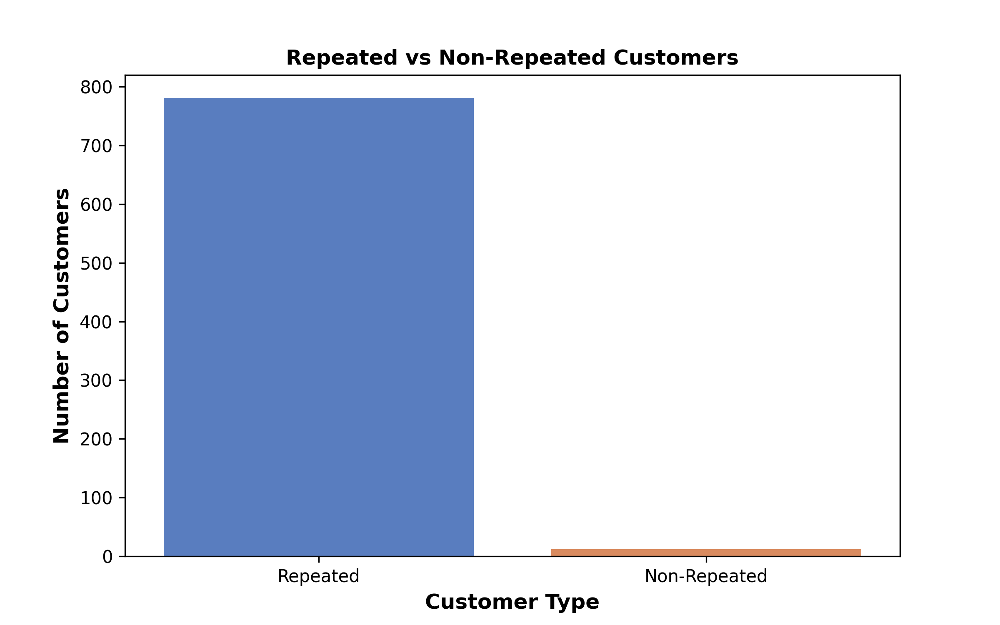
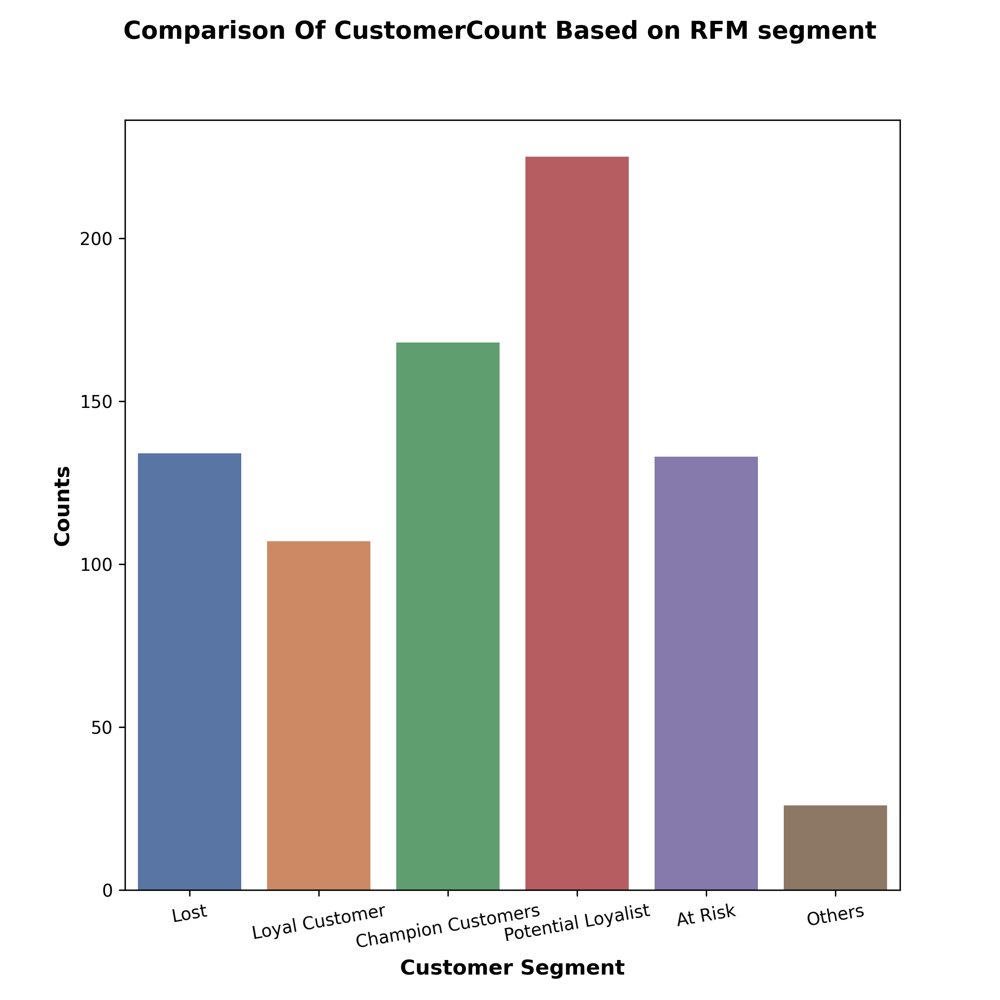

# Superstore-Business-Analytics
## Project Overview:
-  Analyzed a retail dataset with over 7,000 rows and 21 columns covering 4 years of business data.
- Performed customer segmentation using RFM and CLV techniques to identify high-value and at-risk customers.
- Explored sales trends by month, region, and segment to highlight peak periods and low-performing areas.
- Evaluated shipping methods, customer growth by region, and repeat vs non-repeat buying patterns.
- Created detailed visualizations and extracted actionable business insights to support decision-making.
# Project Summary
**1. 📅 Yearly Sales & Profit Trend**

**2. 🛍️ Monthly Sales Trends**

**3. 🚚 Ship Mode Analysis**

**4. 📦 Category vs Sub-Category Counts**

**5. 📍 Region-wise Customer or Sales Count**

**6. 💰 Sales vs Profit Ratio**

**7. 🔄 RFM Segmentation Chart**

**8. 📈 Customer Trends Over Time**

**9. 📌 CLV Segmentation**

**10. High vs Low Lifetime Value customer distribution.**

### Importing Of All Required Liabraries
```python
import pandas as pd
import datetime as dt
import matplotlib.pyplot as plt
import seaborn as sns
import matplotlib.ticker as ticker
import numpy as np
pd.set_option('display.max_columns', None)
```
## Importing File
```python
Data=pd.read_csv('/storage/emulated/0/Download/archive(2) (4)/Sample - Superstore.csv',
encoding='latin1')
```
## #Checking Null
```python
NullChecking=Data.isnull().sum()
```

## Checking Duplicates

```python
Duplicates=Data.duplicated().sum()
```

## changing Datatypes
```python
Data['Order Date']=pd.to_datetime(Data['Order Date'])
Data['Ship Date']=pd.to_datetime(Data['Ship Date'])
```
## Renaming Columns
```python
Data.rename(columns={'Segment':'Customer Segment',
'Category':'Product Category'},inplace=True)
```
## Adding Columns
```python
Data['Year']=Data['Order Date'].dt.year
Data['Day']=Data['Order Date'].dt.day_name()
Data['Delay Days']=(Data['Ship Date']-Data['Order Date']).dt.days
```


# 1.Key Insights:
```python
total_sales = Data['Sales'].sum()
total_profit = Data['Profit'].sum()
total_customers = Data['Customer ID'].nunique()
total_orders = Data['Order ID'].nunique()
```
```python
Visual Code
plt.text(0.1, 0.8, f"|Total Unique Customers\n  {total_customers}",
fontsize=16,family='arial',fontweight='bold', bbox=dict(facecolor='pink', alpha=0.5))
plt.text(0.1, 0.6, f"|Total Sales Generated\n  $ {total_sales:,.0f}",
fontsize=16,family='arial',fontweight='bold', bbox=dict(facecolor='pink', alpha=0.5))
plt.text(0.1, 0.4, f"|Total Profit Earned\n  $ {total_profit:,.0f}",
fontsize=16,family='arial',fontweight='bold', bbox=dict(facecolor='lightgreen', alpha=0.5))
plt.text(0.1, 0.2, f"|Total Orders Placed\n  {total_orders}",
fontsize=16,family='arial',fontweight='bold', bbox=dict(facecolor='lightgreen', alpha=0.5)
plt.axis('off')
# Hide axes
plt.tight_layout(rect=[0,0,0,1])
plt.savefig('Kpi.png')
plt.show()
```


# 2.Top10 Cities Revenue Generated vs Top10 profit Earned Cities 

### Steps:

1.Groups the dataset by City.

2.Calculates total Sales and Profit for each city.

3.Sorts the results by Sales in descending order.

4.Returns the top 10 cities based on revenue generated

5.Performs the same grouping and aggregation.

6.Sorts the cities based on Profit in descending order.

Returns the top 10 cities that earned the highest profit.
```python
Top10RevenueCities=Data.groupby('City')
[['Sales','Profit']].sum()
.sort_values(by='Sales',ascending=False)
.head(10)

Top10ProfitCities=Data.groupby('City')
[['Sales','Profit']].sum().
sort_values(by='Profit',ascending=False)
.head(10)
```
```plaintext
Sales      Profit
City
New York City  256368.1610  62036.9837
Los Angeles    175851.3410  30440.7579
Seattle        119540.7420  29156.0967
San Francisco  112669.0920  17507.3854
Philadelphia   109077.0130 -13837.7674
Houston         64504.7604 -10153.5485
Chicago         48539.5410  -6654.5688
San Diego       47521.0290   6377.1960
Jacksonville    44713.1830  -2323.8350
Springfield     43054.3420   6200.6974
                    Sales      Profit
City
New York City  256368.161  62036.9837
Los Angeles    175851.341  30440.7579
Seattle        119540.742  29156.0967
San Francisco  112669.092  17507.3854
Detroit         42446.944  13181.7908
Lafayette       25036.200  10018.3876
Jackson         24963.858   7581.6828
Atlanta         17197.840   6993.6629
Minneapolis     16870.540   6824.5846
San Diego       47521.029   6377.1960
```
## ✨ Interpretation:
- 1.The first four cities — New York City, Los Angeles, Seattle, and San Francisco — appear in both Top Sales and Top Profit lists, indicating strong alignment between sales revenue and profitability.

- 2.This suggests these cities generate high sales efficiently, converting revenue into profit effectively.
- 3.Cities like Philadelphia, Chicago, Houston, and Jacksonville have high sales but show negative profits, possibly due to:

- i.Higher operational costs

- ii.Increased discounts or returns

- iii.Other expenses affecting profitability

- These areas require further investigation to understand why profits are negative despite good sales.

- 4.Conversely, cities such as Detroit, Lafayette, Jackson, Atlanta, and Minneapolis have moderate or low sales but are among the top profit earners.

- 5.This indicates efficient operations or higher profit margins in these locations, contributing positively to overall profitability.


# 3.1 💰 Customer Lifetime Value (CLV) Analysis

In this step, we calculate the CLV for each customer by combining their average purchase value, purchase frequency, and lifespan. Based on the average CLV, customers are segmented into High Value and Low Value categories.

### ✔️ Key Metrics:
 - 1.Average Purchase Value = Total Sales / Number of Unique Orders

 - 2.Purchase Frequency = Number of Unique Orders per Customer

- 3.Customer Lifespan = Duration between First and Last Purchase (in years)

 - 4.CLV = Average Purchase Value × Purchase Frequency × Lifespan

```python
# Calculate Average Purchase Value
1.Avg_Purchase_Value = Data.groupby('Customer ID')['Sales'].sum() / Data.groupby('Customer ID')['Order ID'].nunique()
Avg_Purchase_Value = Avg_Purchase_Value.reset_index(name='Avg_Purchase_Value')

# Calculate Customer Purchase Frequency
2.Customer_Purchase_Frequency = Data.groupby('Customer ID')['Order ID'].nunique().reset_index(name='Purchase Frequency')

# Calculate Customer Lifespan in Years
3.lifespan = Data.groupby('Customer ID').agg(
    First_Purchase=('Order Date', 'min'),
    Last_Purchase=('Order Date', 'max')
).reset_index()
4.lifespan['Lifespan_Years'] = np.floor((lifespan['Last_Purchase'] - lifespan['First_Purchase']).dt.days / 365)
5.lifespan['Lifespan_Years'] = lifespan['Lifespan_Years'].astype(int)

# Merge All DataFrames
5.CLV_Data = pd.merge(Avg_Purchase_Value, Customer_Purchase_Frequency, on='Customer ID')
6.CLV_Final_Data = pd.merge(CLV_Data, lifespan, on='Customer ID')

# Calculate CLV
7.CLV_Final_Data['Customers_Lifetime_Value'] = (
    CLV_Final_Data['Avg_Purchase_Value'] *
    CLV_Final_Data['Purchase Frequency'] *
    CLV_Final_Data['Lifespan_Years']
)

# Segment Customers Based on Average CLV
8.Avg_Clv = CLV_Final_Data['Customers_Lifetime_Value'].mean()
9.CLV_Final_Data['CLV_Segment'] = np.where(
    CLV_Final_Data['Customers_Lifetime_Value'] > Avg_Clv,
    'High Value',
    'Low Value'
)
```
```pandas

Customer ID  Avg_Purchase_Value  Purchase Frequency First_Purchase  \
0    AA-10315         1112.712000                   5     2014-03-31
1    AA-10375          117.376667                   9     2014-04-21
2    AA-10480          447.628000                   4     2014-05-04
3    AA-10645          847.822500                   6     2014-06-22
4    AB-10015          295.385333                   3     2014-02-18

  Last_Purchase  Lifespan_Years  Customers_Lifetime_Value CLV_Segment
0    2017-06-29               3                 16690.680  High Value
1    2017-12-11               3                  3169.170   Low Value
2    2017-04-15               2                  3581.024   Low Value
3    2017-11-05               3                 15260.805  High Value
4    2016-11-10               2                  1772.312   Low Value

```
## 3.2 📊 CLV Segment Distribution Analysis

This visualization helps to understand how the CLV values are distributed between High Value and Low Value customer segments.
```python
Visual Code

plt.figure(figsize=(6,5),dpi=300)

sns.boxplot(data=CLV_Final_Data,  x='Customers_Lifetime_Value',y='CLV_Segment', palette='flare')
plt.xlabel('Customers Value',fontsize=12, fontweight='heavy')
plt.ylabel('CLV Segment',fontsize=12, fontweight='heavy')
plt.yticks(rotation=90)


plt.suptitle('(CLV) Distribution Analysis',fontsize=16, fontweight='heavy')

plt.savefig('(CLV)1.png')
plt.tight_layout(rect=[0,0,0,1])
plt.subplots_adjust(hspace=0.5,wspace=0.5)
plt.show()
```
## 3.3 Finding Outliers
2.png)

## 3.4 Distribution of Data with High Value vs Low Value Customers
```python
Count the number of customers in each CLV segment
segment_counts = CLV_Final_Data['CLV_Segment'].value_counts()
````
1.png)


## ✨ Interpretation
 - As we Can See We have both Customers High Value and Low Value.
- High Value Customers Are More We have gained.
- There Are also Some of the Customers In High Value have More Value compared to Others giving Priorities to them is very much needed as they are helping us to create high revenue and profits.
- Customers having lifespan Between 1 to 4 years Showing Customer Loyalty Toward are business as they are Regular and Long time Customers.
- As we have total 4 Years Data We Given Lifespan Value Based on their existence in the business from First purchase  Date to Last Purchase Date to know their exact lifespan in the business.

-Customers were divided into two segments:
  - 🔝 **High Value**: Above average CLV
  - 🔻 **Low Value**: Below average CLV

### 📊 Key Insights:
- 🔥 High Value Customers are more profitable and loyal over time.
- 💡 Low Value Customers may need targeted marketing or re-engagement.
- 🧾 Use this segmentation to prioritize retention strategies.


# 4.🧑‍🦱 Customer Segment Analysis
 - simply grouping the data based on Customer segment.
 - finding total number of unique customers from each segment.
 - To See From where we have most customers vs where we have generated more sales.
 - Then Sales Trend of Customer Segment by year to see which customer segment have grown or which segment performance declined.
```python
CustomersByCustomerSegment=Data.groupby('Customer Segment')['Customer ID'].nunique().reset_index()
CustomersByCustomerSegment.columns=['Customer Segment','Unique Customers']
```
```python
Visual Code
plt.figure(figsize=(8, 6),dpi=300)
plt.subplot(2,1,1)
sns.countplot(data=Data,x='Customer Segment',palette='vlag')
plt.title('Total Unique Customers of Each Customer Segment',fontsize=14,fontweight='heavy')
plt.xlabel('Customer Segment',fontsize=14,fontweight='heavy')
plt.ylabel('Count',fontsize=14,fontweight='heavy')
plt.grid(axis='y',color='gray',linestyle=':',linewidth=0.5)

plt.subplot(2,1,2)
sns.barplot(data=Data,x='Customer Segment',y='Sales',palette='Blues')
plt.title(' Total Sales By Each Customer Segment',fontsize=14,fontweight='heavy')
plt.xlabel('Customer Segment',fontsize=14,fontweight='heavy')
plt.ylabel('Sales',fontsize=14,fontweight='heavy')
plt.grid(axis='y',color='gray',linestyle=':',linewidth=0.5)

plt.suptitle("Comparison of Total Customers vs Sales By CustomerSegment",
fontsize=14,fontweight='heavy')
plt.subplots_adjust(hspace=0.5, wspace=0.5)
plt.savefig('Customer_Segment.png')

plt.figure(figsize=(8,6),dpi=300)
sns.barplot(data=Data,x='Customer Segment',y='Sales',hue='Year')
plt.title('Customer Segment Yearly Sales Trend',fontsize=14,fontweight='heavy')
plt.xlabel('Customer Segment',fontsize=14,fontweight='heavy')
plt.ylabel('Sales',fontsize=14,fontweight='heavy')
plt.grid(axis='y',color='gray',linestyle=':',linewidth=1)

plt.suptitle("Yearly Sales Trend By Customer Segment",
fontsize=14,fontweight='heavy')
plt.tight_layout(rect=[1,1,1,3])
plt.subplots_adjust(hspace=0.5, wspace=0.5)
plt.savefig('Customer_Segment.png')
```


```plaintext
🏠 Fewer Customers: Home Office  
👥 Most Customers: Consumer Segment  
🔥 High Sales (2014): Home Office  
📈 Top Segment (2016–17): Corporate  
⚖️ All Segments: Performing Well Overall
```
## ✨ Interpretation:
 
## 🧍‍♂️ Customers vs Sales by Segment

- Based on **Customer Segments** available in the original data.
- Comparison of **total unique customers** vs **total sales generated** by each segment was done to understand overall growth across all years.
- The **Home Office** segment has **fewer customers**, while the **Consumer** segment has the **most customers**.
- In terms of sales, **Home Office generated the lowest overall sales** — the situation is reversed between customer count and revenue.

## 📊 Yearly Sales Trend by Segment

- To get a **clearer picture**, we analyzed the **yearly sales trend** of each segment.
- In **2014**, the **Home Office** segment generated the **highest sales**.
- In the latest years (**2016 and 2017**), the **Corporate** segment achieved the **top position** in sales.
- There is only a **slight difference** in total sales across all customer segments, showing **balanced and consistent performance**.

## 📈 Segment Performance Overview

- **All segments are performing well** overall.
- The **Consumer** segment maintained **moderate sales** in **2015 and 2016**.

# 5.  📈 Customer Trend & Order Insights (2014–2017)
```python
CustomersPerYear=Data.groupby('Year')
['Customer ID'].nunique().reset_index()
CustomersPerYear.columns=
['Year','Customer Count']

OrdersPerYear=Data.groupby('Year')
['Order ID'].nunique().
sort_values(ascending=False)
PerYearOrders=OrdersPerYear.reset_index()
PerYearOrders.columns=['Year','Total Orders']
```
```python
visual code
plt.figure(figsize=(8,6),dpi=300)
plt.subplot(1,2,1)
sns.lineplot(data=CustomersPerYear,x='Year',y='Customer Count',
color='green',marker='o')
plt.title('Customer Trend By Year',fontsize=12,fontweight='bold',)
plt.xlabel('Year',fontsize=12,fontweight='bold')
plt.ylabel('Total Customers',fontsize=12,fontweight='bold')
plt.grid(axis='y',color='pink', alpha=0.7)
plt.gca().xaxis.set_major_locator(ticker.MaxNLocator(integer=True))

plt.subplot(1,2,2)

sns.lineplot(data=PerYearOrders, x='Year', y='Total Orders', marker='o', linewidth=2, palette='Oranges')

plt.title('Orders Per Year', fontsize=12, fontweight='heavy')
plt.xlabel('Years', fontsize=12,fontweight='heavy')
plt.ylabel('Number of Orders Per Year', fontsize=12,fontweight='heavy')
plt.grid(axis='y',color='pink', alpha=0.7)

plt.suptitle('Yearly Business Performance',
fontsize=14,fontweight='heavy')
plt.tight_layout(rect=[1,1,1,3])
plt.subplots_adjust(hspace=0.5, wspace=0.5)
plt.savefig('Yearly Trend.png')

plt.show()
``` 


### ✨ Interpretation:
 
- ❌ In **2014**, the business had a good number of customers but **lost** some of them the following year.
- 🔁 Surprisingly, in **2015**, despite the drop in customers, the number of **orders increased**, indicating stronger engagement or repeat purchases.
- 📊 From **2016 to 2017**, both **customers and orders showed steady growth**, highlighting a **positive customer trend**.
- ✅ Comparing **customer count vs. order count** gave valuable insights — a rise in customers clearly contributed to more orders in the later years.
- 
# 6. 🔁 Repeated vs Non-Repeated Customers
### Steps:
- 1.We first extracted all unique customers using .unique() to avoid counting duplicates. Then, we filtered the dataset to include only those unique customers for accurate analysis of their order behavior.
- 2.This code identifies whether each customer is a repeated or non-repeated buyer based on their number of unique orders. If a customer has placed more than one order, they are labeled as Repeated, else Non-Repeated.
```python
UniqueCustomers=pd.DataFrame(Data['Customer ID'].unique(),columns=['Customer ID'])

UniqueCustomersData=Data[Data['Customer ID'].isin(UniqueCustomers['Customer ID'])]

CustomersWithOrderCounts=UniqueCustomersData.groupby('Customer ID')['Order ID'].nunique()

CustomersWithOrderCounts = CustomersWithOrderCounts.reset_index()

 CustomersWithOrderCounts['Customer Type'] = np.where(

 CustomersWithOrderCounts['Order ID'] > 1, 'Repeated', 'Non-Repeated' ) 
```


## ✨Interpretation:
- 📦 **Repeated Customers**: Customers who have placed **more than 1 order**.
- 🧍 **Non-Repeated Customers**: Customers who have placed **only 1 order**.

### 📊 Why This Is Useful:
- Stored results in `CustomerswithOrderCounts` DataFrame for easy tracking and future analysis.
- 🛍️ Helps identify **non-repeated customers** — useful for targeting with:
  - 🔖 Discounts
  - 🤝 Recommendations
  - 💬 Personalized outreach

- 🔄 Repeated customer data is valuable to:
  - 🔍 Understand **frequently ordered products**
  - 🎯 Discover customer **interests & preferences**

# 7.📈 Seasonal Sales & Profit Trend Analysis (2014–2017)
```python
Sales_MonthlyandYearly=Data.groupby(['Year','MonthName','Month'])
[['Sales','Profit']].sum().reset_index()
Sales_MonthlyandYearly=Sales_MonthlyandYearly.sort_values
(by=['Year','Month'])
```


## ✨ Interpretation:
```plaintext
🔥 High Sales: November 2017
❄️ Low Sales: February (All years)
```
**Strong Months**: October, November, December  
*Needs Focus*: February, April
```plaintext
🔴 Low Performing Months
- February
- April
```

###  📊 Sales Trend Summary

September and December show consistently good sales, especially in 2016 and 2017.

November 2017 recorded the highest sales overall.

February had the lowest sales across all years and needs more attention.

October sales were low in 2014 and 2015, but improved in 2016 and 2017.

The consecutive months September, October, November, and December are the strongest performing months.

### 💰 Profit vs Sales Comparison

In 2016, highest profits were seen in October and December.

In 2017, March showed the highest profit, indicating a shift in market trend.

March had good sales in both 2016 and 2017, but profit came only in 2017.

This shows a partial correlation between high sales and profit in months like October, November, December, and March.

The business faced losses (negative profits) in early years (2014 and 2017)

### ⚠️ Months Needing More Attention

February and March: Poor profit performance in all four years.

April: Sales similar to June and July, but not generating enough profit.

Moderate profit observed in June, July, August, and January in 2017.

Indicates a seasonal shift in profit patterns.

# 8.📈 Categorical Analysis(Shipping Performance, Customers Regional Growth & Product Category Spread) (2014–2017)

## 🧭 Customer Distribution & Growth Across Regions


## 📦 Shipping Performance & Product Category Analysis


## ✨ Interpretation:
```plaintext
📦 Ship Mode:  
- Standard Class used most, but delays high
🌍 Regions:  
- West has most customers, South the least
🛒 Products:  
- Product variety visible in sub-categories
📈 Growth:  
- Customer growth in East, Central, West
```
### 🚚 Shipping Mode Analysis

‘Standard Class’ is the most frequently used ship mode by the business.

However, it also has the highest average delivery delay, which may impact customer satisfaction.

📌 Action Point: Investigate and improve logistics for Standard Class to reduce delays.

### 🗺️ Business Spread Across Regions & Categories

🏙️ Region-wise State Count

Central and East regions have the highest number of states covered.

Indicates that the business has tried to expand widely across these areas.

### 👥 Customer Count by Region

Despite fewer states, the West region has the highest customer count over 4 years.

South region has the lowest customer engagement.

East and Central regions also show good customer numbers, with East slightly leading.

✅ Positive Trend: There's consistent growth in customers in East, Central, and West regions.


### 📦 Product Category Spread

Count of Sub-Categories within each Product Category shows the diversity in offerings.

Helps understand how broad the product catalog is under each category.

🔍 Key Takeaways

⚠️ Standard Class delays should be addressed to maintain service quality.

🧭 South region needs focused marketing or service improvements to boost customer base.

📊 East region is performing well in terms of both state presence and customer base — shows potential for further growth.

🛒 Expanding product diversity under well-performing categories can support business growth.
 
# 9.🎯 RFM-Based Customer Behavior Analysis
```python
# 1. Calculate total spending per customer
CustomerSpending = UniqueCustomersDetails.groupby('Customer ID')['Sales']
.sum().reset_index(name='CustomerSpending')

# 2. Calculate purchase frequency per customer
CustomerOrderFrequency = UniqueCustomersDetails.
groupby('Customer ID')['Order ID'].nunique().reset_index(name='PurchaseFrequency')

# 3. Get last purchase date
CustomerLastPurchase = UniqueCustomersDetails.
groupby('Customer ID')['Order Date'].max().reset_index(name='Last Purchase')
Current_Date = pd.to_datetime('today')

# 4. Merge all metrics into one DataFrame
Merge = pd.merge(CustomerSpending,
 CustomerOrderFrequency, on='Customer ID')
RFM_Customers = pd.merge(
Merge, CustomerLastPurchase,on='Customer ID')

# 5. Calculate recency in days
RFM_Customers['Recency'] = (Current_Date - RFM_Customers['Last Purchase']).dt.days

# 6. RFM scoring using quartiles (1 to 4)
r = pd.qcut(RFM_Customers['Recency'], q=4, labels=range(4, 0, -1))
f = pd.qcut(RFM_Customers['PurchaseFrequency'], q=4, labels=range(1, 5))
m = pd.qcut(RFM_Customers['CustomerSpending'], q=4, labels=range(1, 5))

RFM = RFM_Customers.assign(R=r.values, F=f.values, M=m.values)

# 7. Combine scores
RFM['RFM_Score'] = RFM['R'].astype(int) + RFM['F'].astype(int) + RFM['M'].astype(int)

# 8. Segment customers based on RFM values
def segment_customer(row):
    if row['R'] >= 3 and row['F'] >= 3 and row['M'] >= 3:
        return 'Champion Customers'
    elif row['R'] >= 3 and row['F'] >= 2:
        return 'Loyal Customer'
    elif row['R'] >= 2 and row['F'] <= 2:
        return 'Potential Loyalist'
    elif row['R'] <= 2 and row['F'] >= 3:
        return 'At Risk'
    elif row['R'] == 1 and row['F'] == 1:
        return 'Lost'
    else:
        return 'Others'

RFM['Segment'] = RFM.apply(segment_customer, axis=1)
```
```python
visual Code
plt.figure(figsize=(8, 8),dpi=300)
sns.countplot(data=RFM,x='Segment',palette='deep')
plt.xlabel('Customer Segment',fontsize=12,fontweight='heavy')
plt.ylabel('Counts',fontsize=12,fontweight='heavy')
plt.xticks(rotation=10)

plt.suptitle('Comparison Of CustomerCount Based on RFM segment',fontsize=14,fontweight='heavy')
plt.savefig('RFM.png')
plt.tight_layout(rect=[0,0,0,1])
plt.subplots_adjust(hspace=0.5,wspace=0.5)
plt.show()
``` 

## Explaination:

**📌 R (Recency): Calculate days since each customer's last purchase.**

**🔁 F (Frequency): Count how many orders each customer placed.**

**💰 M (Monetary): Sum total spending by each customer.**

**📊 Scoring: Use qcut() to assign scores (1–4) for R, F, and M.**

**🏷️ Segmenting: Classify customers based on RFM scores into groups like Champions, Loyal, At Risk, etc.**
Others**

 ## ✨ Interpretation:
 
### 🏆 Champion Customers
- High R, F, and M scores
- Recent buyers, frequent, and high spenders

### 🤝 Loyal Customers
- Good frequency and recency
- Moderate monetary score

### 🌱 Potential Loyalist
- Recently active but low frequency

### ⚠️ At-Risk Customers
- Haven’t bought recently but used to buy often

### 💔 Lost Customers
- Low in all 3 areas

### 📌 Others
- Do not fit into clear categories

# ✅ Recommendations
- Monitor sales vs profit ratio regularly—don’t just push for higher sales.
- Conduct marketing surveys in the South region to understand low performance and address issues.
- Optimize or reconsider the Standard Class shipping method to reduce average delivery delays.
- Offer incentives for customers to choose faster and more reliable shipping modes.
- Offer targeted discounts to "At Risk" or "Lost" RFM segments.
- Re-engage non-repeating customers with personalized offers or recommendations.
- 
# ✅ Limitations
**❌ No Customer Feedback or Ratings**
The dataset does not include customer reviews or satisfaction scores, so we cannot determine the exact reasons why some customers stopped purchasing.

**📉 No Marketing or Promotion Data**
There is no information on advertisements, campaigns, or promotions, which limits the ability to assess their impact on sales and customer behavior.

**⏳ Unclear Reasons for Delivery Delays**
Although shipping delays are measured, there is no data on external factors (like weather, holidays, or supplier issues), making it difficult to identify exact causes.

📌 Conclusion
The business showed strong growth in recent years, especially in festive months.

West region had the highest customer base; South region needs more focus.

'Standard Class' shipping caused the most delivery delays.

RFM and CLV analysis helped identify loyal and at-risk customers.

These insights can guide better marketing, logistics, and customer strategies.

## 📬 Contact Me

If you'd like to connect or have any questions, feel free to reach out:

- 📧 Email: shaikhshahi326@gmail.com  
- 💼 LinkedIn: (https://www.linkedin.com/in/shahista24) 
